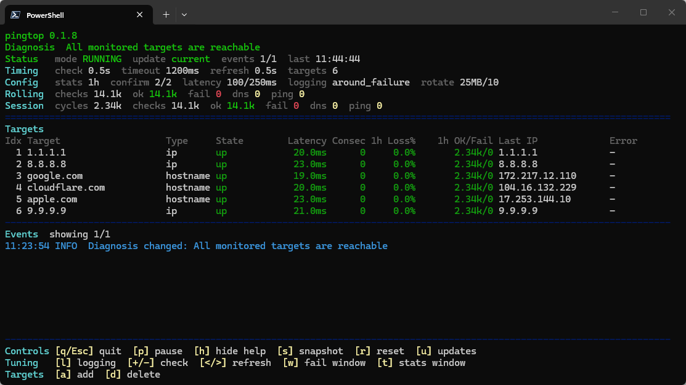

# pingtop

<p>
  <a href="https://github.com/Landmine-1252/pingtop-go/actions/workflows/ci.yml"></a>
  <a href="https://github.com/Landmine-1252/pingtop-go/blob/main/go.mod"></a>
  <a href="https://goreportcard.com/report/github.com/landmine-1252/pingtop-go"></a>
</p>

<p>
  <a href="https://github.com/Landmine-1252/pingtop-go/releases"></a>
  <a href="https://github.com/Landmine-1252/pingtop-go/releases"></a>
  <a href="https://github.com/Landmine-1252/pingtop-go/releases"></a>
  <a href="https://github.com/Landmine-1252/pingtop-go/releases"></a>
</p>

`pingtop` is a Go rewrite of the original Python [`pingtop`](https://github.com/Landmine-1252/pingtop).



## What It Does

- live terminal UI with redraws, color, and keyboard controls
- concurrent ping and DNS checks with simple failure classification
- interactive mode and headless mode
- single-binary releases for Linux, macOS, and Windows
- ad hoc target runs from the command line without writing CSV logs

## Downloads

Prebuilt binaries are published on [GitHub Releases](https://github.com/Landmine-1252/pingtop-go/releases).

- platforms: Linux, macOS, Windows
- architectures: `amd64`, `arm64`, Linux `armv7`
- packaging: single binary per archive, no Go runtime required
- size: release asset sizes vary by platform and version; see the latest release assets for exact download sizes

## Quick Start

Run from source:

```bash
go run .           # interactive UI when a supported TTY is available
go run . -n        # headless mode
go run . -o        # single pass
go run . -v        # version
go run . -h        # help
go run . -u        # one-shot update check
go run . --updates
go run . 1.1.1.1
go run . example.com 1.1.1.1
```

Build locally:

```bash
go build -o pingtop
./pingtop
./pingtop -h
./pingtop -v
./pingtop -u
./pingtop --updates
```

Build `pingtop.exe` on Windows:

```powershell
go build -o pingtop.exe .
.\pingtop.exe
.\pingtop.exe -h
.\pingtop.exe -v
.\pingtop.exe -u
.\pingtop.exe --updates
```

Passing one or more positional targets overrides the configured target list for that run only. Those ad hoc runs keep the normal UI or headless behavior, but CSV logging is disabled for that session.

To debug update detection without publishing a new release, run:

```bash
pingtop -u
pingtop --updates
pingtop -u --current-version 0.1.3
pingtop --check-updates --current-version 0.1.3 --update-repo https://github.com/Landmine-1252/pingtop-go
```

## Controls

The interactive UI starts with help visible by default and remembers the last help visibility choice in `pingtop.json`. Press `h` to show or hide the full help panel.

**Controls**
- `q` or `Esc`: quit
- `p`: pause or resume
- `h`: show or hide help
- `s`: save a snapshot
- `r`: reset session counters
- `u`: open the release page
- `Up` / `Down`: scroll older or newer events
- `PgUp` / `PgDn`: page through event history

**Tuning**
- `l`: cycle logging mode
- `+` / `-`: increase or decrease the check interval
- `<` / `>`: adjust the UI refresh rate
- `w`: set the around-failure window
- `t`: set the stats window

**Targets**
- `a`: add a target
- `d`: delete a target

## Release Flow

Before tagging a release, update [`internal/pingtop/version.go`](internal/pingtop/version.go) so `Version` matches the tag value without the optional leading `v`.

Then push either tag format:

```bash
git tag 0.1.3
git push origin 0.1.3
```

or:

```bash
git tag v0.1.3
git push origin v0.1.3
```

The release workflow verifies that the tag and source version match, runs tests, builds release archives, and attaches them to the GitHub release automatically.

## Tests

```bash
go test ./...
```
